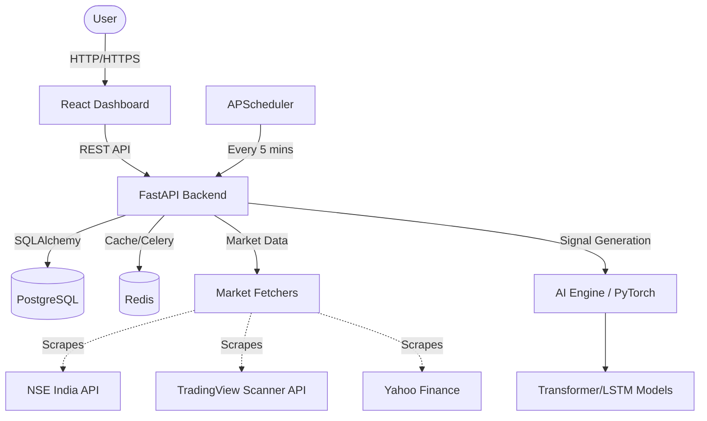

# Quantro Personal AI - System Architecture

Quantro Personal AI is an automated, AI-driven stock market analysis and trading signal generation system specifically tuned for the Indian Stock Market (NSE/BSE).

## 🏢 High-Level Architecture

The system follows a microservices-inspired architecture managed via Docker Compose, splitting responsibilities across dedicated containers for the frontend, backend, database, and caching layers.

## 🧩 Core Components

### 1. Frontend (Dashboard)
- **Tech Stack:** React 18, Vite, TypeScript, Tailwind CSS v3, Shadcn UI, Lucide Icons.
- **Role:** Provides a premium, glassmorphism-styled UI for visualizing AI signals, reviewing technical/fundamental breakdowns, and managing portfolio holdings.
- **Key Features:** Persisted tabs, dynamic row expansion for deep-dive analysis, and real-time confidence bars.

### 2. Backend (API & Engine)
- **Tech Stack:** Python 3.11, FastAPI, SQLAlchemy (Async), Pydantic.
- **Role:** Serves as the central orchestrator. It handles user authentication, exposes REST endpoints for the dashboard, and houses the heavy lifting for market data collection and AI inference.
- **Key Sub-Modules:**
  - `services/market_data`: Handles real-time data scraping from NSE, TradingView, and YFinance.
  - `services/signal_engine`: Contains the `HybridStrategy` which merges traditional technical indicators (MACD, RSI, Volatility) with AI predictions.
  - `services/ai_engine`: Loads PyTorch models to predict bullish/bearish probabilities based on normalized OHLCV data.

### 3. Database Layer
- **Tech Stack:** PostgreSQL 15.
- **Role:** Persistently stores users, stock metadata, OHLCV historical data, active trading signals, and portfolio holdings.

### 4. Background Automation
- **Tech Stack:** APScheduler.
- **Role:** A global scheduler runs inside the FastAPI process. Every 5 minutes, it triggers a background task that:
  1. Aggregates live top gainers from the NSE API and TradingView Market Scanner.
  2. Fetches their latest fundamentals, news, and OHLCV data.
  3. Runs the AI models to generate fresh signals.
  4. Flushes expired signals (yesterday's) so the dashboard remains strictly real-time.

## 🔄 Data Flow (The 5-Minute Screener)

1. **Trigger:** `APScheduler` fires `run_frequent_analysis` every 5 minutes.
2. **Scan:** The system sends stealth requests to `https://www.nseindia.com/api/live-analysis-variations?index=gainers` and `scanner.tradingview.com`.
3. **Filter:** The returned high-liquidity gainers are deduplicated and portfolio holdings are excluded. The top 15 candidates are selected.
4. **Fetch:** `YFinanceFetcher` retrieves 300 days of historical data for these 15 candidates, alongside their live fundamentals and news.
5. **Process:** `IndicatorCalculator` generates technical indicators (SMA, RSI, MACD, Bollinger Bands).
6. **Predict:** The `AIModelManager` runs PyTorch models against the data to assign an AI Confidence score.
7. **Consensus:** The `HybridStrategy` evaluates the Technical Score vs. the AI Confidence. If they contradict, a "HOLD" signal is forced. If they align, a BUY/SELL signal is persisted to PostgreSQL.
8. **Deliver:** The frontend fetches the updated table on the next load/refresh.

## 🚀 Deployment

The entire stack is containerized using Docker. 
- **Development:** Run `docker compose up --build` to spin up the API, Dashboard, DB, and Redis locally.
- **Production:** The stack can be deployed seamlessly to a high-memory cloud instance (e.g., Oracle Cloud Ampere A1 Free Tier) to run the background scraping and AI inference 24/7 without interruption.
